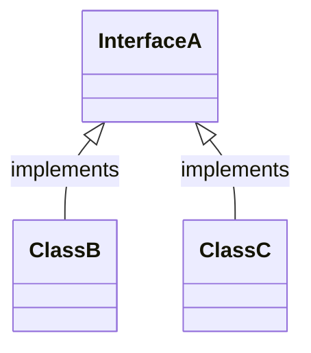

# Herencia y polimorfismo

## Herencia

La herencia es un concepto fundamental en la orientación a objetos. Se podría decir que dos de los pilares más importantes de la orientación a objetos son: la encapsulación (es decir, el aislamiento de los datos internos de un objeto y la manipulación de los mismos a través de métodos, lo que da garantías de seguridad y proporciona una capa de abstracción) y la herencia. 

Algunos lenguajes tienen herencia múltiple. No es el caso de Java. Una clase sólo puede heredar de otra (pero a su vez, ésta puede heredar de una tercera, por lo que puede haber árboles de herencia en la que cada nodo tiene un único padre). 

Los objetos heredan las propiedades (atributos) y el comportamiento (métodos) de todas las clases a las que pertenecen. Pero, a su vez, las clases puede extender o modificar los atributos y métodos heredados (salvo que sean de tipo final). Uno de los principales objetivos de la herencia es posibilitar la reutilización de código al máximo, lo que hace que el conjunto de la aplicación sea más fácil de mantener. 

## Polimorfismo

El polimorfismo se refiere a la posibilidad de modificar métodos. Si por ejemplo tenemos lo siguiente: 

```java
class A {
    public int a(int b){
        return b*4;
    }
}

class B extends A {
    public int a(int b) {
        return super.a() * 7;
    }
}
```

Hemos creado un esquema de clases en la que la clase B extiende a la clase A, y donde el método a() ha sido sobreescrito. La palabra clave `super` permite usar el método de la clase padre en la clase hija. 

```java
var a = new A();
var b = new B();
a.a(2);
b.a(2);
```

La primera llamada devolverá 8, mientras que la segunda 56. 

## Composición

Es otra técnica de orientación a objetos que puede usarse para modificar el comportamiento de una clase existente. Supongamos que tenemos una clase `Persona` y queremos definir `Empleado` como un tipo particular de persona. En lugar de usar herencia, podemos "recubrir" una persona con funcionalidad extra en una nueva clase que no extienda a la original. En este ejemplo, haríamos: 

```java
class Persona {...}

class Empleado {
    Persona p;
    public Empleado(Persona p) {
        this.p = p;
    }

    public getNombre() {
        // Esto es lo típico de la composición: delegamos la responsabilidad en el objeto "interno" siempre que tenga sentido. 
        return p.getNombre();
    }
}
```

## Interfaces

Una interfaz es similar a una clase abstracta, pero sin atributos. En una interfaz sólo tenemos cabeceras de métodos. Definir una interfaz viene a ser como definir un "contrato", y las clases que implementan la interfaz cumplen con el contrato (hacen las funciones que el contrato especifica).

Es una forma de resolver la limitación de la herencia múltiple en Java: una clase puede implementar muchas interfaces. 

Al mismo tiempo, una interfaz se comporta como una clase en el sentido de que define un "tipo". Por ejemplo:

```java
public interface Vehiculo {
    public void mueve();
}

public class Coche implements Vehiculo {
    public void mueve() {
        // Tiene que dar cuerpo a todos los métodos de la interfaz. 
        ...
    }
}

public class Moto implements Vehiculo {
    public void mueve() {
        // Tiene que dar cuerpo a todos los métodos de la interfaz. 
        ...
    }
}

Vehiculo v1 = new Coche();
Vehiculo v2 = new Moto();
ArrayList<Vehiculo> a = new ArrayList<Vehiculo>();
a.add(v1);
a.add(v2);
// Puedo hacer esto porque el compilador sabe que cualquier objeto que implemente Vehiculo tiene el método mueve():
a.get(1).mueve(); // Llamará al método de Moto, ya que v2 internamente es una instancia de Moto. 
```
Las interfaces también pueden tener jerarquía: una interfaz puede extender otra interfaz añadiendo métodos al contrato. 

## Casting

Dos conceptos importantes son el upcasting y el downcasting.

Supongamos que tenemos la siguiente jerarquía de tipos: 



Entonces, el upcasting sería: 

```java
// Definir una variable y darle el tipo superior -el de la interfaz-
InterfaceA i = new ClassB();
```

Mientras que el downcasting sería: 

```java
// saber que una variable es de un tipo inferior y usarlo: 
// Supongamos que a es un ArrayList<InterfaceA>
ClassC c = (ClassC) a.get(0);
// La conversión funciona si realmente a[0] es de tipo ClassC; podría ser de ClassB y en ese caso
// tendríamos un error de ejecución.
```

# Referencias

* [Java Inheritance](https://www.w3schools.com/java/java_inheritance.asp)
* [Java Polymorphism](https://www.w3schools.com/java/java_polymorphism.asp)
* [Java Inner Classes](https://www.w3schools.com/java/java_inner_classes.asp)
* [Java Abstraction](https://www.w3schools.com/java/java_abstract.asp)
* [Java Interfaces](https://www.w3schools.com/java/java_interface.asp)